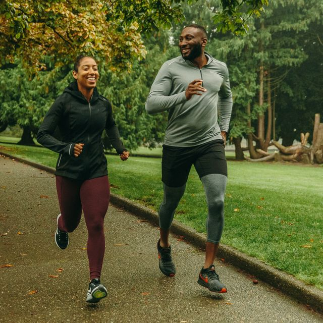

# HTML-Assignment
<H3> Name : DHANUSH S</H3>
<H3>Register No.212221230020</H3>
<H3> Web Fundamentals and HTML Assignment</H3>
<H3>DATE:03-07-2024</H3>

## Aim :
    To Creating a web page using HTML
## Algorithm:
###Step 1: Set Up Your Environment 
Before you start writing HTML, you need: 
A text editor (e.g., Notepad, Sublime Text, Visual Studio Code). 
A web browser (e.g., Google Chrome, Firefox). 
###Step 2:Create a New HTML File 
Open your text editor. 
Create a new file and save it with a .html extension, for example, index.html. 
###Step 3: Basic HTML Structure 
Every HTML document should have a basic structure that includes the <!DOCTYPE html> declaration, and the <html>, <head>, and <body> tags. 
###Step 4:Adding Content 
You can now add content to your web page using various HTML elements. 
###Step 5:Save and View Your Web Page 
Save the HTML file. 
Open the saved file in your web browser by double-clicking it or by right-clicking and selecting "Open with" and then your preferred browser. 

## Program:

<!DOCTYPE html>
<html lang="en">
<head>
    <meta charset="UTF-8">
    <meta name="viewport" content="width=device-width, initial-scale=1.0">
    <title>Document</title>
</head>
<body>
    <table border="1px"width="100%">
        <tbody>
                <tr>
                    <td colspan="2" align="center">
                        <strong>My Day</strong>
                    </td>

                </tr>
                <tr>
                    <td>
                        <ol>
                            <li>
                                Wake up only
                                <ul>
                                    <li>
                                        2 am
                                    </li>
                                    <li>
                                        walk
                                    </li>

                                    <li>
                                        jpg
                                    </li>
                                </ul>
                            </li>    
                        </ol>
                    </td>
                    <td rowspan="4" width="50%">
                        <table border="1px" width="50%" align="center">
                            <tr>
                                <td colspan="2" align="center">
                                    <strong>Things to Watch</strong>
                                </td>
                            </tr>
                            <tr>
                                <td>
                                    
                                </td>
                                <td>
                                    
                                </td>
                            </tr>
                            <tr>
                                <td>
                                    
                                </td>
                                <td>
                                    
                                </td>
                            </tr>
                        </table>
                    </td>
                    
                
                                </ul>
                            </li>
                            
                            
                        </ol>
                    </td>
                    
                </tr>
                <tr>
                    <td>
                        <ol>
                            <li>
                                Breakfast
                                <ul>
                                    <li>
                                        8 am
                                    </li>
                                    <li>
                                        eggs
                                    </li>

                                    <li>
                                        Coffee
                                    </li>
                                </ul>
                            </li>
                        </ol>
                    </td>                    
                </tr>
                <tr>
                    <td>
                        <ol>
                            <li>
                                Go to Saveetha Engineering college
                                <ul>
                                    <li>
                                        8 am
                                    </li>
                                    <li>
                                        attend classes
                                    </li>

                                    <li>
                                        to be continued
                                    </li>
                                </ul>
                            </li>
                        </ol>
                    </td>                
                </tr>

                
        </tbody>

        
    </table>
</body>
</html>

## Output:

## Result:
   Thus a creating web page image using Html is successfull .

